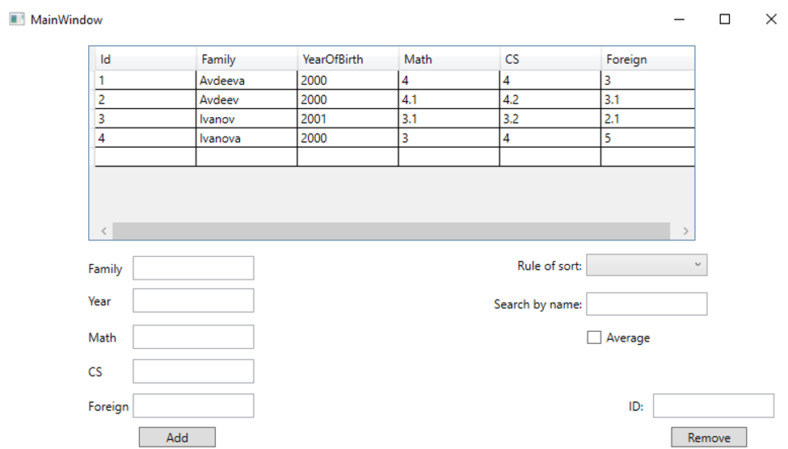

C# with DB - learning project 
 
The theme of this project has been received me in university as semester work. 
It is a simple C#-project that can add, sort and delete records from a local MySQL-database 
 

